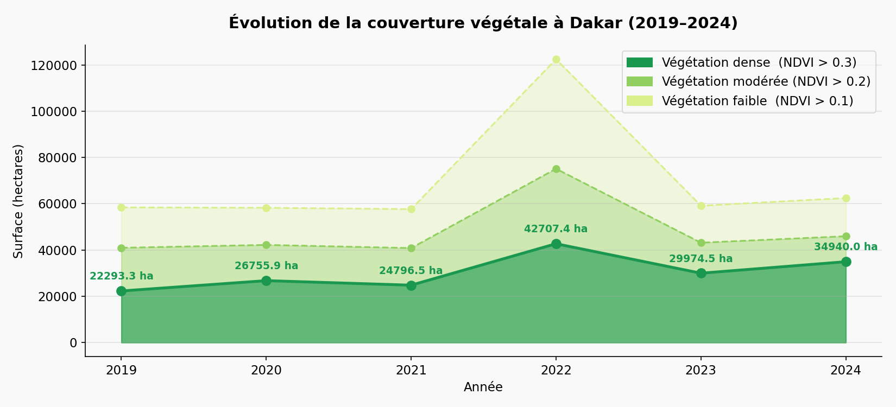
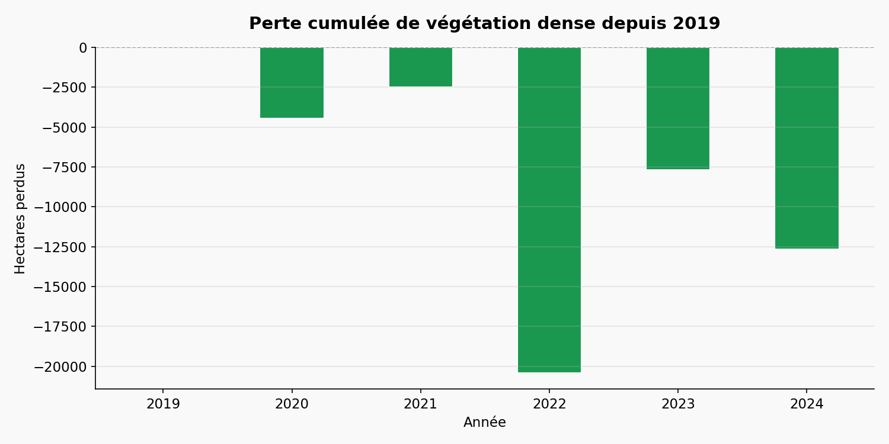
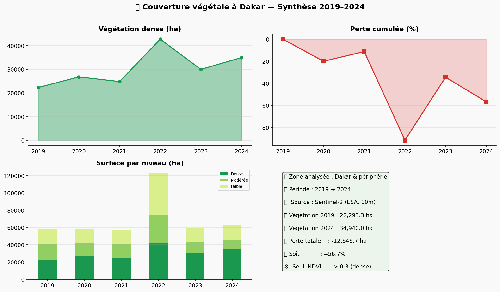

# 🌍 Analyse de la Couverture Végétale à Dakar (2019–2024)


> Projet de data science appliqué à la télédétection satellitaire.  
> Mesure de la perte de végétation urbaine à Dakar entre 2019 et 2024  
> à partir d'images Sentinel-2 et du calcul d'indices NDVI.

---

## 📌 Contexte

Dakar est l'une des métropoles africaines à la croissance urbaine la plus rapide.
Cette expansion se fait souvent au détriment des espaces verts, avec des conséquences
directes sur la qualité de vie, les îlots de chaleur urbains et la biodiversité locale.

Ce projet quantifie cette perte de végétation de manière objective, en s'appuyant
sur des données satellitaires gratuites et des outils open-source.

---

## 🎯 Objectifs

- Mesurer l'évolution de la couverture végétale à Dakar entre 2019 et 2024
- Identifier les zones géographiques les plus touchées par la déforestation urbaine
- Produire des cartes thématiques et des visualisations exploitables
- Déployer un dashboard interactif pour communiquer les résultats

---

## 🗂️ Structure du projet
```
vegetation-dakar/
│
├── 📁 code/
│   ├── 01_test_gee.py            # Test de connexion Google Earth Engine
│   ├── 02_premier_ndvi.py        # Premier calcul NDVI sur Dakar
│   ├── 03_carte_ndvi.py          # Carte NDVI interactive (HTML)
│   ├── 04_comparaison.py         # Comparaison NDVI 2019 vs 2024
│   ├── 05_analyse_surface.py     # Calcul des surfaces en hectares
│   └── 06_graphiques.py          # Génération de tous les graphiques
│
├── 📁 outputs/
│   ├── analyse_surface_dakar.csv          # Données brutes exportées
│   ├── 📁 cartes/
│   │   └── carte_comparaison_2019_2024.html
        |__carte_ndvi_dakar.html
│   └── 📁 graphiques/
│       ├── 01_evolution_vegetation.png
│       ├── 02_perte_cumulee.png
│       ├── 03_camembert_comparaison.png
│       └── 04_dashboard_resume.png
│   |__analyse_surface_dakar.csv

├── app.py                        # Dashboard Streamlit
├── requirements.txt              # Dépendances Python
├── .env                          # Variables d'environnement (non partagé)
└── README.md                     # Ce fichier
```

---

## 🛰️ Données utilisées

| Source | Satellite | Résolution | Période |
|---|---|---|---|
| Google Earth Engine | Sentinel-2 SR Harmonized | 10 m/pixel | 2019–2024 |
| ESA Copernicus | Sentinel-2 | 10 m/pixel | Nov–Déc (saison sèche) |

**Pourquoi la saison sèche ?**  
Les images de novembre–décembre présentent moins de couverture nuageuse
au Sénégal, ce qui garantit une meilleure qualité d'analyse.

---

## 🌿 Méthodologie

### 1. Collecte des images
Images Sentinel-2 filtrées avec moins de 10% de nuages,
puis composition médiane pour éliminer les anomalies résiduelles.

### 2. Calcul du NDVI
```
NDVI = (NIR - Rouge) / (NIR + Rouge)
     = (Bande B8 - Bande B4) / (Bande B8 + Bande B4)
```

### 3. Classification de la végétation

| Valeur NDVI | Classe |
|---|---|
| > 0.3 | Végétation dense |
| 0.2 – 0.3 | Végétation modérée |
| 0.1 – 0.2 | Végétation faible |
| < 0.1 | Sol nu / Bâti / Eau |

### 4. Analyse de changement
Soustraction pixel par pixel des cartes NDVI entre 2019 et 2024.
Les zones avec une baisse > 0.1 sont identifiées comme pertes significatives.

### 5. Calcul des surfaces
Chaque pixel Sentinel-2 représente 100 m² (10m × 10m).
La surface totale est calculée via `ee.Image.pixelArea()` puis convertie en hectares.

---

## 🖼️ Visualisations

### Évolution de la végétation dense


### Perte cumulée


### Synthèse dashboard


---

## 🚀 Reproduire le projet

### Prérequis
- Python 3.10+
- Un compte Google Earth Engine approuvé → https://earthengine.google.com

### Installation
```bash
# Cloner le projet
git clone https://github.com/ton-username/vegetation-dakar.git
cd vegetation-dakar

# Créer un environnement virtuel
python -m venv env
source env/bin/activate      # Linux/Mac
env\Scripts\activate         # Windows

# Installer les dépendances
pip install -r requirements.txt

# Configurer les variables d'environnement
cp .env.example .env
# Éditer .env et renseigner ton GEE_PROJECT
```

### Exécution
```bash
# 1. Tester la connexion GEE
python code/01_test_gee.py

# 2. Calculer les NDVI et surfaces (environ 5–10 min)
python code/04_comparaison.py
python code/05_analyse_surface.py

# 3. Générer les graphiques
python code/06_graphiques.py

# 4. Lancer le dashboard
streamlit run app.py
```

---

## 🧰 Stack technique

| Outil | Usage |
|---|---|
| `earthengine-api` | Accès aux données satellitaires |
| `geemap` | Visualisation cartes GEE |
| `pandas` | Manipulation des données tabulaires |
| `matplotlib` | Graphiques statiques |
| `folium` | Carte interactive dans Streamlit |
| `streamlit` | Dashboard web interactif |
| `python-dotenv` | Gestion des variables d'environnement |

---

## 🔍 Limites et perspectives

**Limites actuelles**
- Sentinel-2 disponible seulement depuis 2019 (pas de données avant)
- Analyse limitée à la saison sèche (nov–déc)
- Le rectangle de Dakar inclut des zones maritimes

**Améliorations possibles**
- Étendre l'analyse à Landsat 8 pour remonter jusqu'à 2013
- Croiser avec des données d'urbanisation (bâti, population)
- Ajouter une analyse par quartier (Plateau, Pikine, Guédiawaye...)
- Déployer le dashboard sur Streamlit Cloud

---

## 👤 Auteur

Maïmouna SOW
Étudiante en Inteligence Artificielle et Big Data — Dakar, Sénégal  
📧 sowmounass55@gmail.com   
🐙 [GitHub](https://github.com/SowMaimouna)

---

## 📄 Licence

Ce projet est sous licence MIT — libre d'utilisation avec attribution.

---

*Projet réalisé dans le cadre d'une initiation à la data science  
appliquée aux enjeux environnementaux urbains en Afrique de l'Ouest.*
```

---

## ✅ Checklist finale du projet
```
✅ 01_test_gee.py
✅ 02_premier_ndvi.py
✅ 03_carte_ndvi.py
✅ 04_comparaison.py
✅ 05_analyse_surface.py
✅ 06_graphiques.py
✅ app.py  (Streamlit)
✅ requirements.txt
✅ .env
✅ README.md